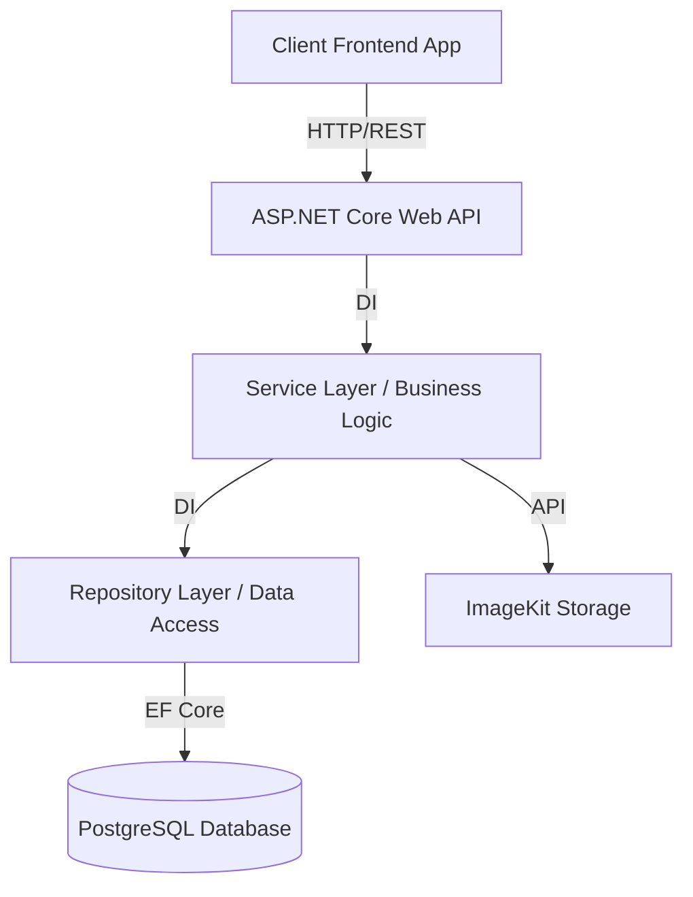

<div align="center">
  <h1>🚀 NearU – Backend API</h1>
  <p><b>The core backend RESTful API powering the NearU platform: A University Lifestyle Hub and Local Business Marketplace.</b></p>
  
  [](https://dotnet.microsoft.com/)
  [](https://www.postgresql.org/)
  [](https://docs.microsoft.com/en-us/ef/core/)
  [](https://swagger.io/)
  [](https://jwt.io/)
</div>

---

## 📖 Overview

**NearU** is designed to connect students with nearby businesses and services. This repository contains the backend RESTful API built with **ASP.NET Core 10 Web API**, providing secure endpoints for user authentication, business management, service discovery, orders, delivery coordination, job postings, and notifications.

It serves as the **core business logic layer** of the system, communicating with the frontend application and a PostgreSQL database.

---

## ✨ Features

### 🔐 User Management & Security
- Registration and secure authentication (ASP.NET Identity + JWT & Refresh Tokens)
- Role-based access control (Student, Business Owner, Rider, Admin)
- Password hashing (BCrypt) and API Rate Limiting

### 🏪 Business Management
- Create and manage business listings
- Photo and menu uploads (Integrated with ImageKit)
- Business verification system and dashboard support

### 🔍 Search & Discovery
- Keyword-based search for businesses
- Filtering by category, rating, and location
- Google Maps API integration for location services

### 📦 Order & Delivery Coordination
- Place, track, and manage order history
- Businesses can create delivery jobs
- Riders can accept, complete, and track delivery tasks

### ⭐ Review & Rating System
- Users can submit reviews with ratings and photo attachments
- Business owners can respond to reviews

### 💼 Job Board
- Businesses can post part-time jobs
- Students can apply and track applications

---

## 🛠️ Technology Stack

| Component | Technology |
| :--- | :--- |
| **Framework** | ASP.NET Core 10 Web API (C#) |
| **Database** | PostgreSQL (with SQLite fallback) |
| **ORM** | Entity Framework Core 10 |
| **Authentication** | JWT (JSON Web Tokens) Bearer |
| **Storage** | ImageKit |
| **API Docs** | Swagger / OpenAPI |
| **Security** | BCrypt.Net, AspNetCoreRateLimit |

---

## 🏗️ System Architecture



---

## 📂 Project Structure

```text
NearU-Backend/
├── Controllers/       # API endpoints mapping to routes
├── Services/          # Core business logic
├── Repositories/      # Database access abstraction
├── Models/            # Database entity models
├── DTOs/              # Data Transfer Objects
├── Data/              # EF Core DbContext and Migrations
├── Middleware/        # Custom pipelines (Auth, Error Handling)
├── Configuration/     # App configuration setups
├── Enums/             # Shared enumerations
└── Program.cs         # Application entry point
```

---

## 🚀 Getting Started

### Prerequisites
- [.NET 10 SDK](https://dotnet.microsoft.com/download/dotnet/10.0)
- Visual Studio 2022 / VS Code / JetBrains Rider
- PostgreSQL Server

### Installation & Setup

1. **Clone the repository:**
   ```bash
   git clone https://github.com/yourusername/nearu-backend.git
   cd nearu-backend
   ```

2. **Restore dependencies:**
   ```bash
   dotnet restore
   ```

3. **Configure the Database:**
   Update `appsettings.json` or `appsettings.Development.json` with your PostgreSQL credentials:
   ```json
   "ConnectionStrings": {
     "PostgreSQL": "Host=localhost;Port=5432;Database=nearu_db;Username=postgres;Password=YOUR_PASSWORD"
   },
   "DatabaseProvider": "PostgreSQL"
   ```

4. **Apply Migrations:**
   ```bash
   dotnet ef database update
   ```

5. **Run the Application:**
   ```bash
   dotnet run
   ```
   *The API will run locally at `http://localhost:5000` or `https://localhost:5001`.*

---

## 📚 API Documentation

This project uses **Swagger** for interactive API documentation.
Once the application is running, navigate to:

```text
https://localhost:5001/swagger
```
Here you can explore all available endpoints, required parameters, authentication requirements, and test requests directly from the browser.

---

## 🔒 Security & Performance

- **Authentication:** JWT Bearer tokens with Refresh Token rotation.
- **Authorization:** Role-Based Access Control (RBAC).
- **Protection:** SQL Injection protection via EF Core parameterized queries, rate limiting via `AspNetCoreRateLimit`, secure password hashing via `BCrypt`.
- **CORS:** Configured for frontend communication.

---

## 👥 Contributors

**Group 11 – Faculty of Computing**  
*Sabaragamuwa University of Sri Lanka*

- **K.W.T.N. Keerthiwansha** – Full Stack Developer & System Architect  
- **W.T.M.B. Wijesuriya** – Frontend Developer & UI/UX Designer  
- **K.V.P. Pahasara** – Cloud & DevOps Engineer  
- **M.U. Heshan** – QA Engineer & Project Manager  

---

## 📄 License

This project is developed for **academic purposes as part of a university capstone project**.
