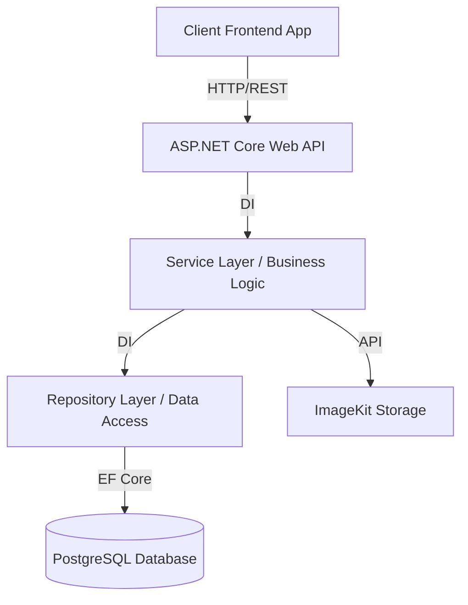

<div align="center">
  <h1>🚀 NearU – Backend API</h1>
  <p><b>The core backend RESTful API powering the NearU platform: A University Lifestyle Hub and Local Business Marketplace.</b></p>
  
  [](https://dotnet.microsoft.com/)
  [](https://www.postgresql.org/)
  [](https://docs.microsoft.com/en-us/ef/core/)
  [](https://swagger.io/)
  [](https://jwt.io/)
</div>

---

## 📖 Overview

**NearU** is designed to connect university students with nearby businesses and services. This repository contains the backend RESTful API built with **.NET 10 (ASP.NET Core Web API)**, providing secure and efficient endpoints for user authentication, business management, service discovery, order processing, delivery coordination, job postings, and notifications.

It serves as the **core business logic layer** of the system, communicating with the frontend application and a PostgreSQL database.

---

## ✨ Features

### 🔐 User Management & Security
- Registration and secure authentication using ASP.NET Identity + JWT & Refresh Tokens.
- Role-based access control (Student, Business Owner, Rider, Admin).
- Password hashing (BCrypt) and API Rate Limiting for brute-force protection.

### 🏪 Business Management
- Create and manage business listings.
- Photo and menu uploads integrated natively with **ImageKit**.
- Business verification system and dashboard metrics support.

### 🔍 Search & Discovery
- Keyword-based search for businesses.
- Filtering by category, rating, and location.
- Extensible location services integration.

### 📦 Order & Delivery Coordination
- Place, track, and manage order history.
- Businesses can create delivery jobs.
- Riders can accept, complete, and track delivery tasks.

### ⭐ Review & Rating System
- Users can submit reviews with ratings and photo attachments.
- Business owners can view and respond to reviews.

### 💼 Job Board
- Businesses can post part-time or full-time jobs.
- Students can apply and track their applications.

---

## 🛠️ Technology Stack

| Component | Technology |
| :--- | :--- |
| **Framework** | .NET 10 / ASP.NET Core Web API (C#) |
| **Database** | PostgreSQL |
| **ORM** | Entity Framework Core 10 |
| **Authentication** | JWT (JSON Web Tokens) Bearer |
| **Storage / Media** | ImageKit |
| **API Docs** | Swagger / OpenAPI |
| **Security** | BCrypt.Net, AspNetCoreRateLimit |

---

## 🏗️ System Architecture



---

## 📂 Project Structure

```text
NearU-Backend/
├── Configuration/     # App configuration and dependency injection setups
├── Controllers/       # API endpoints mapping to HTTP routes
├── Services/          # Core business logic layer
├── Repositories/      # Database access abstraction (Repository Pattern)
├── Models/            # Database entity models (Code-First)
├── DTOs/              # Data Transfer Objects for API requests/responses
├── Data/              # EF Core DbContext and Migrations
├── Middleware/        # Custom pipelines (e.g., Global Error Handling)
├── Enums/             # Shared enumerations
└── Program.cs         # Application entry point & service registration
```

---

## 🚀 Getting Started

### Prerequisites
- [.NET 10 SDK](https://dotnet.microsoft.com/download/dotnet/10.0)
- Visual Studio 2022 / JetBrains Rider / VS Code
- PostgreSQL Server (Local or Cloud-hosted)

### Installation & Setup

1. **Clone the repository:**
   ```bash
   git clone https://github.com/Nearu-Project-SUSL/NearU-Backend.git
   cd NearU-Backend
   ```

2. **Restore dependencies:**
   ```bash
   dotnet restore
   ```

3. **Configure Settings:**
   Open `appsettings.json` or create `appsettings.Development.json` and configure the necessary secrets. You will need a PostgreSQL connection, a JWT secret, and ImageKit credentials.

   ```json
   {
     "ConnectionStrings": {
       "PostgreSQL": "Host=localhost;Port=5432;Database=nearu_db;Username=postgres;Password=YOUR_PASSWORD"
     },
     "JwtSettings": {
       "SecretKey": "YOUR_SUPER_SECRET_JWT_KEY_AT_LEAST_32_CHARS",
       "Issuer": "NearU-Backend",
       "Audience": "NearU-Client",
       "AccessTokenExpiryInMinutes": 15,
       "RefreshTokenExpiryInDays": 7
     },
     "ImageKit": {
       "PublicKey": "YOUR_IMAGEKIT_PUBLIC_KEY",
       "PrivateKey": "YOUR_IMAGEKIT_PRIVATE_KEY",
       "UrlEndpoint": "https://ik.imagekit.io/your_endpoint"
     }
   }
   ```

4. **Apply Migrations:**
   Ensure your database is created and up to date by applying Entity Framework migrations:
   ```bash
   dotnet ef database update
   ```

5. **Run the Application:**
   ```bash
   dotnet run
   ```
   *The API will run locally, typically at `http://localhost:5000` or `https://localhost:5001` depending on your launch profile.*

---

## 📚 API Documentation

This project uses **Swagger** for interactive API documentation and endpoint testing.
Once the application is running, navigate to the Swagger UI in your browser:

```text
https://localhost:5001/swagger
```
From here, you can explore all available endpoints, required parameters, schema definitions, and authenticate using the "Authorize" button to test protected routes.

---

## 🔒 Security & Performance

- **Authentication:** JWT Bearer tokens with robust Refresh Token rotation.
- **Authorization:** Granular Role-Based Access Control (RBAC).
- **Data Protection:** SQL Injection protection via EF Core parameterized queries.
- **Rate Limiting:** API endpoint throttling via `AspNetCoreRateLimit` to prevent abuse.
- **Password Security:** Secure hashing mechanism using `BCrypt`.
- **CORS:** Properly configured for secure frontend-backend communication.
- **Benchmark Results:** https://nearu-project-susl.github.io/NearU-Backend/dev/bench/

---

## 👥 Contributors

**Group 11 – Faculty of Computing**  
*Sabaragamuwa University of Sri Lanka*

- **K.W.T.N. Keerthiwansha** – Full Stack Developer & System Architect  
- **W.T.M.B. Wijesuriya** – Frontend Developer & UI/UX Designer  
- **K.V.P. Pahasara** – Cloud & DevOps Engineer  
- **M.U. Heshan** – QA Engineer & Project Manager  

---

## 📄 License

This project is developed for **academic purposes as part of a university capstone project**.
