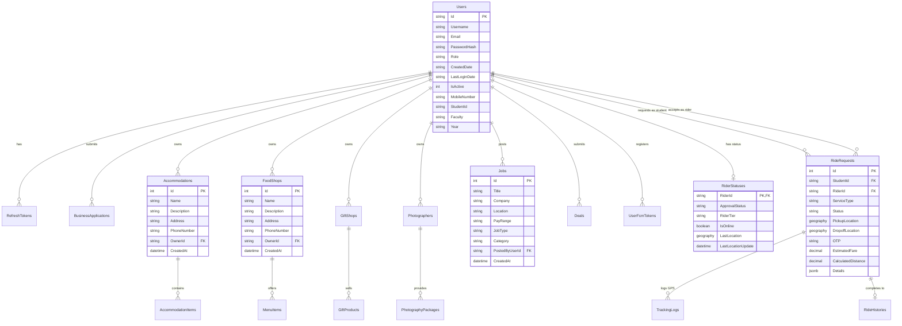

# NearU — Database Schema & Data Model Specification

---

## 1. Entity Relationship Diagram (ERD)



---

## 2. Comprehensive Entity Schema Tables

### **1. Users Table (`Users`)**
Stores account metadata across all system roles (Student, Rider, BusinessOwner, Admin).

| Column Name | Data Type | Constraints | Description |
| :--- | :--- | :--- | :--- |
| `Id` | `NVARCHAR(450)` | `PRIMARY KEY` | Unique GUID identifier string. |
| `Username` | `NVARCHAR(100)` | `NOT NULL` | User handle / username. |
| `Email` | `NVARCHAR(150)` | `NOT NULL, UNIQUE` | User email address. |
| `PasswordHash` | `NVARCHAR(MAX)` | `NOT NULL` | BCrypt salted password hash. |
| `Role` | `NVARCHAR(50)` | `NOT NULL` | System role (`Student`, `Rider`, `BusinessOwner`, `Admin`). |
| `CreatedDate` | `NVARCHAR(50)` | `NOT NULL` | ISO Timestamp string of account creation. |
| `LastLoginDate` | `NVARCHAR(50)` | `NULL` | ISO Timestamp of last successful authentication. |
| `IsActive` | `INT` | `NOT NULL, DEFAULT 1` | Status flag (`1` = Active, `0` = Suspended). |
| `MobileNumber` | `NVARCHAR(20)` | `NULL` | Primary contact phone number. |
| `StudentId` | `NVARCHAR(50)` | `NULL` | University Student Registration Index Number. |
| `Faculty` | `NVARCHAR(100)` | `NULL` | University Faculty name (e.g., Applied Sciences, Management). |
| `Year` | `NVARCHAR(20)` | `NULL` | Academic year level (e.g., 1st Year, 2nd Year). |
| `Address` | `NVARCHAR(200)` | `NULL` | Physical address. |
| `City` | `NVARCHAR(100)` | `NULL` | Hometown or current city. |
| `ProfilePictureUrl` | `NVARCHAR(500)` | `NULL` | CDN URL to user avatar photo. |

---

### **2. Refresh Tokens Table (`RefreshTokens`)**
Manages refresh token rotation for secure session management.

| Column Name | Data Type | Constraints | Description |
| :--- | :--- | :--- | :--- |
| `Id` | `INT` | `PRIMARY KEY, AUTO_INCREMENT` | Unique token record ID. |
| `Token` | `NVARCHAR(500)` | `NOT NULL, UNIQUE INDEX` | Cryptographically secure random token string. |
| `UserId` | `NVARCHAR(450)` | `NOT NULL, FK(Users.Id)` | Associated user account ID. |
| `ExpiryDate` | `TIMESTAMPTZ` | `NOT NULL` | Expiration timestamp (e.g., 7 days). |
| `CreatedDate` | `TIMESTAMPTZ` | `NOT NULL` | Token creation timestamp. |
| `RevokedDate` | `TIMESTAMPTZ` | `NULL` | Timestamp when token was invalidated. |
| `ReplacedByToken` | `NVARCHAR(500)` | `NULL` | Token string that replaced this token upon refresh. |
| `ReasonRevoked` | `NVARCHAR(200)` | `NULL` | Audit reason for revocation (e.g., "Replaced by new token", "Logout"). |

---

### **3. Student Accommodations Table (`Accommodations`)**
Stores student boarding house listings, hostels, and annexes.

| Column Name | Data Type | Constraints | Description |
| :--- | :--- | :--- | :--- |
| `Id` | `INT` | `PRIMARY KEY, AUTO_INCREMENT` | Unique accommodation ID. |
| `Name` | `NVARCHAR(100)` | `NOT NULL` | Accommodation title / property name. |
| `Description` | `NVARCHAR(500)` | `NULL` | Detailed property description, amenities, rules. |
| `Address` | `NVARCHAR(200)` | `NULL` | Physical address / street name. |
| `PhoneNumber` | `NVARCHAR(20)` | `NULL` | Contact phone for inquiries. |
| `OwnerId` | `NVARCHAR(450)` | `NULL, FK(Users.Id)` | User ID of landlord / business owner (Set Null on delete). |
| `CreatedAt` | `TIMESTAMPTZ` | `DEFAULT NOW()` | Record creation timestamp. |

---

### **4. Accommodation Items Table (`AccommodationItems`)**
Individual room units or bed slots within an accommodation listing.

| Column Name | Data Type | Constraints | Description |
| :--- | :--- | :--- | :--- |
| `Id` | `INT` | `PRIMARY KEY, AUTO_INCREMENT` | Unit ID. |
| `AccommodationId`| `INT` | `NOT NULL, FK(Accommodations.Id)`| Parent accommodation listing ID (Cascade Delete). |
| `Name` | `NVARCHAR(100)` | `NOT NULL` | Room title (e.g., "Single Occupancy Room", "Double Bed Shared"). |
| `Description` | `NVARCHAR(300)` | `NULL` | Room features (e.g., Attached bathroom, AC, Wi-Fi). |
| `Price` | `DECIMAL(10,2)` | `NOT NULL` | Monthly rent price in LKR. |
| `PhotoUrl` | `NVARCHAR(500)` | `NULL` | Image URL of room unit. |

---

### **5. Ride Requests Table (`RideRequests`)**
Core ride-hailing entity managing student commute requests.

| Column Name | Data Type | Constraints | Description |
| :--- | :--- | :--- | :--- |
| `Id` | `INT` | `PRIMARY KEY, AUTO_INCREMENT` | Unique ride request ID. |
| `StudentId` | `NVARCHAR(450)` | `NOT NULL, FK(Users.Id)` | Passenger student user ID (Restrict Delete). |
| `RiderId` | `NVARCHAR(450)` | `NULL, FK(Users.Id)` | Assigned student rider user ID (Set Null on delete). |
| `ServiceType` | `VARCHAR(50)` | `NOT NULL` | Enum string (`Bike`, `TukTuk`, `Delivery`). |
| `Status` | `VARCHAR(50)` | `NOT NULL, INDEX` | Enum string (`Pending`, `Accepted`, `RiderEnRoute`, `RiderArrived`, `InProgress`, `Completed`, `Cancelled`). |
| `PickupLocation` | `geography(Point,4326)` | `NOT NULL` | Spatial point for pickup location. |
| `DropoffLocation`| `geography(Point,4326)` | `NOT NULL` | Spatial point for dropoff destination. |
| `OTP` | `CHAR(4)` | `NOT NULL` | 4-digit numeric verification OTP required to start ride. |
| `EstimatedFare` | `DECIMAL(10,2)` | `NOT NULL` | Calculated trip fare estimation in LKR. |
| `CalculatedDistance`|`DECIMAL(6,3)`| `NOT NULL` | Total route distance in kilometers. |
| `Details` | `JSONB` | `NULL` | Additional JSON metadata (e.g., pickup note, landmark). |

---

### **6. Rider Statuses Table (`RiderStatuses`)**
Operational state and live GPS tracking for registered student drivers.

| Column Name | Data Type | Constraints | Description |
| :--- | :--- | :--- | :--- |
| `RiderId` | `NVARCHAR(450)` | `PRIMARY KEY, FK(Users.Id)`| Rider user account ID. |
| `ApprovalStatus` | `VARCHAR(50)` | `NOT NULL` | Verification status (`PendingApproval`, `Approved`, `Rejected`). |
| `RiderTier` | `VARCHAR(50)` | `NOT NULL` | Rider performance tier (`Standard`, `Gold`, `Platinum`). |
| `IsOnline` | `BOOLEAN` | `NOT NULL, DEFAULT false` | Driver availability status toggle. |
| `LastLocation` | `geography(Point,4326)`| `NULL` | PostGIS spatial point of driver's current position. |
| `LastLocationUpdate`|`TIMESTAMPTZ`| `NULL` | Timestamp of last received GPS location ping. |

---

### **7. Job Listings Table (`Jobs`)**
Part-time jobs and campus freelance micro-gigs.

| Column Name | Data Type | Constraints | Description |
| :--- | :--- | :--- | :--- |
| `Id` | `INT` | `PRIMARY KEY, AUTO_INCREMENT` | Job ID. |
| `Title` | `NVARCHAR(200)` | `NOT NULL` | Job title (e.g., "Lab Assistant", "Graphic Designer"). |
| `Company` | `NVARCHAR(100)` | `NOT NULL` | Business / employer name. |
| `Location` | `NVARCHAR(100)` | `NOT NULL` | Job location / campus faculty. |
| `PayRange` | `NVARCHAR(100)` | `NOT NULL` | Hourly or fixed pay (e.g., "Rs. 1,500/hr"). |
| `JobType` | `NVARCHAR(50)` | `NOT NULL` | Type (`Part-Time`, `Freelance`, `Gig`). |
| `Category` | `NVARCHAR(50)` | `NOT NULL, INDEX` | Industry category. |
| `PostedByUserId` | `NVARCHAR(450)` | `NOT NULL, FK(Users.Id)` | User ID of job poster. |

---

## 3. Spatial Data & PostGIS Integration Details

NearU utilizes **PostGIS** with the **WGS 84 (SRID 4326)** Spatial Reference System via **NetTopologySuite**.

### **Distance & Proximity Search Logic:**
1. **Nearby Rider Discovery (ST_DWithin)**: Finds all online riders within a 5km radius of a student pickup location:
   ```sql
   SELECT "RiderId", ST_Distance("LastLocation", @pickupPoint) AS DistanceMeters
   FROM "RiderStatuses"
   WHERE "IsOnline" = true 
     AND "ApprovalStatus" = 'Approved'
     AND ST_DWithin("LastLocation", @pickupPoint, 5000);
   ```

2. **Haversine / Spatial Fare Estimation**: Calculates spherical distance between pickup and dropoff points:
   ```csharp
   double distanceKm = pickupLocation.Distance(dropoffLocation) / 1000.0;
   decimal estimatedFare = BaseFare + (decimal)(distanceKm * PerKmRate);
   ```
