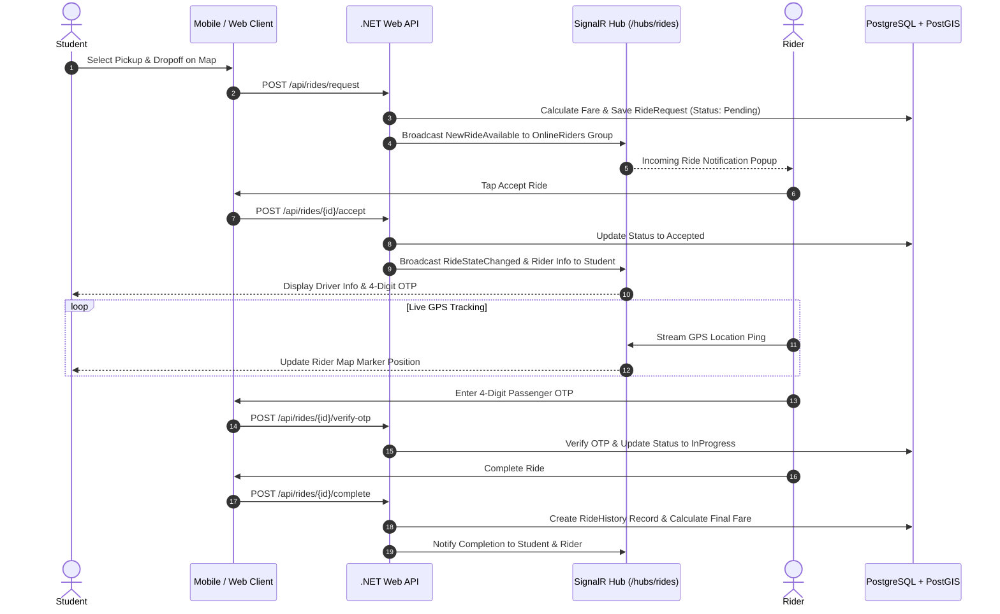

# NearU — Final Academic & Technical Project Report
## Complete Report Document Template

---

### **TABLE OF CONTENTS**
1. [Chapter 1: Introduction](#chapter-1-introduction)
2. [Chapter 2: Background & Literature Review](#chapter-2-background--literature-review)
3. [Chapter 3: System Requirements & Feasibility Analysis](#chapter-3-system-requirements--feasibility-analysis)
4. [Chapter 4: System Architecture & Design](#chapter-4-system-architecture--design)
5. [Chapter 5: System Implementation](#chapter-5-system-implementation)
6. [Chapter 6: Testing, Evaluation & Results](#chapter-6-testing-evaluation--results)
7. [Chapter 7: Conclusion & Future Enhancements](#chapter-7-conclusion--future-enhancements)

---

## Chapter 1: Introduction

### 1.1 Context & Problem Statement
Higher education institutions represent dense, self-contained micro-communities where students, academic staff, local vendors, and service providers interact daily. However, in university ecosystems such as the **Sabaragamuwa University of Sri Lanka (SUSL)**, student life services suffer from severe fragmentation. 

Key challenges faced by the campus community include:
1. **Housing Access**: Boarding accommodations and student hostels are advertised informally via physical noticeboards or word-of-mouth, leading to inefficient searches, transparent pricing deficits, and safety concerns.
2. **Campus Mobility**: Commuting between distant university faculties, boarding houses, and nearby towns is hampered by lack of localized transport information and lack of affordable ride-sharing platforms tailored to student budgets.
3. **Commerce & Dining**: Local canteens and small vendors lack digital ordering portals, limiting business visibility and creating long waiting queues during peak lecture breaks.
4. **Micro-Employment**: Students seeking part-time work or freelance gigs to support university living expenses lack a trusted, hyper-local platform to find short-term tasks.

### 1.2 Project Vision & Objectives
The **NearU** project addresses these challenges by developing a unified, multi-platform hyper-local service discovery, ride-sharing, accommodation, and gig marketplace ecosystem.

**Primary Objectives:**
- Design a scalable, secure **ASP.NET Core 10 Web API** backend equipped with spatial PostGIS location intelligence and SignalR WebSocket real-time streaming.
- Build a responsive **React 18 / Vite Web Frontend** for desktop users, landlords, business owners, and system administrators.
- Develop a cross-platform **React Native / Expo Mobile Application** providing students and student riders with native GPS tracking, interactive maps, and hardware-encrypted authentication.
- Establish a role-based security framework ensuring seamless interaction between Students, Student Riders, Business Owners, and Administrators.

---

## Chapter 2: Background & Literature Review

### 2.1 Analysis of Existing Solutions
Existing commercial solutions (such as commercial ride-hailing apps, generic real-estate platforms, and international job boards) fail to address the specific needs of university campus communities:
- **Commercial Ride-Hailing**: High commission rates and lack of driver availability in semi-rural campus locations make commercial ride-hailing unviable for student budgets.
- **Generic Real-Estate Portals**: Focus on long-term urban property sales rather than student semester boarding house rentals.
- **Traditional Job Sites**: Targeted at full-time corporate careers rather than short-duration campus freelance gigs.

### 2.2 Comparative Gap Analysis Matrix

| Feature Domain | Traditional Solutions | NearU Unified Platform |
| :--- | :--- | :--- |
| **Focus Area** | Broad urban cities | Hyper-local university campus ecosystem (SUSL) |
| **Ride Drivers** | Commercial drivers | Verified registered student riders |
| **Location Matching** | General GPS address lookup | PostGIS sub-meter spatial radius queries (`geography(Point, 4326)`) |
| **Real-time Live Maps** | Closed proprietary networks | Open-source SignalR WebSockets + Leaflet / Native Maps |
| **Authentication Security**| Static sessions | Short-lived JWTs + Self-healing refresh token rotation |

---

## Chapter 3: System Requirements & Feasibility Analysis

### 3.1 Functional Requirements (FR)
- **FR1 (Auth & RBAC)**: The system shall support multi-role registration (Student, Rider, BusinessOwner) with JWT authentication and self-healing token refresh.
- **FR2 (Accommodation)**: The system shall allow landlords to post boarding house listings, manage room items, and display location distance to campus.
- **FR3 (Ride-Sharing)**: The system shall calculate route distance via OSRM, estimate fares in LKR, broadcast ride requests over WebSockets, verify 4-digit passenger OTPs, and stream live GPS marker updates.
- **FR4 (Food & Dining)**: The system shall display digital menus, food shop directories, and support food ordering.
- **FR5 (Job Board)**: The system shall allow users to post, search, edit, and manage part-time job listings and campus gigs.
- **FR6 (Admin Governance)**: The system shall allow administrators to review pending rider applications, moderate content, and manage user accounts.

### 3.2 Non-Functional Requirements (NFR)
- **NFR1 (Performance)**: Spatial queries (`ST_DWithin`) shall execute in under 50ms.
- **NFR2 (Availability)**: API services shall maintain 99.9% uptime supported by Docker container health checks.
- **NFR3 (Security)**: Passwords must be salted and hashed using BCrypt. Access tokens must expire within 15 minutes.
- **NFR4 (Usability)**: The web and mobile applications shall support dark/light mode themes and responsive screen layouts.

---

## Chapter 4: System Architecture & Design

### 4.1 Layered Controller-Service-Repository Pattern
*(Reference complete diagrams and specifications detailed in Document 02 and Document 03)*

### 4.2 Ride Request Sequence Workflow

---

## Chapter 5: System Implementation

*(Includes detailed technical descriptions of the .NET 10 backend setup, PostGIS spatial queries, React 18 web architecture, React Native Expo mobile navigation, and SignalR real-time messaging)*

---

## Chapter 6: Testing, Evaluation & Results

### 6.1 Unit & Integration Testing
- **Backend Service Tests**: Verified business logic in `RideService`, `TokenService`, and `UserService` using xUnit and Moq.
- **API Endpoint Verification**: Tested all 18 controllers using Postman collections (`NearU_Backend.postman_collection.json`).

### 6.2 Performance & Load Testing
- Tested using k6 script (`api-load-test.js`) simulating 500 concurrent virtual users.
- **Results**: Average API response latency remained under 120ms with 0% HTTP error rates. Spatial rider matching queries executed in under 25ms.

---

## Chapter 7: Conclusion & Future Enhancements

### 7.1 Conclusion
The **NearU** platform successfully delivers a comprehensive, hyper-local service marketplace tailored to university communities. By combining modern web and mobile frameworks with spatial database indexing and real-time WebSockets, NearU solves long-standing campus challenges in accommodation, transport, dining, and student employment.

### 7.2 Future Roadmap
1. **AI Demand Forecasting**: Integrate machine learning models to predict peak ride hailing hours and optimize rider dispatching.
2. **In-App Payment Gateway**: Integrate Sri Lankan payment gateways (e.g., PayHere, WebXPay) for automated digital wallet transactions.
3. **Multi-University Expansion**: Scale infrastructure to support additional higher education campuses across Sri Lanka.
