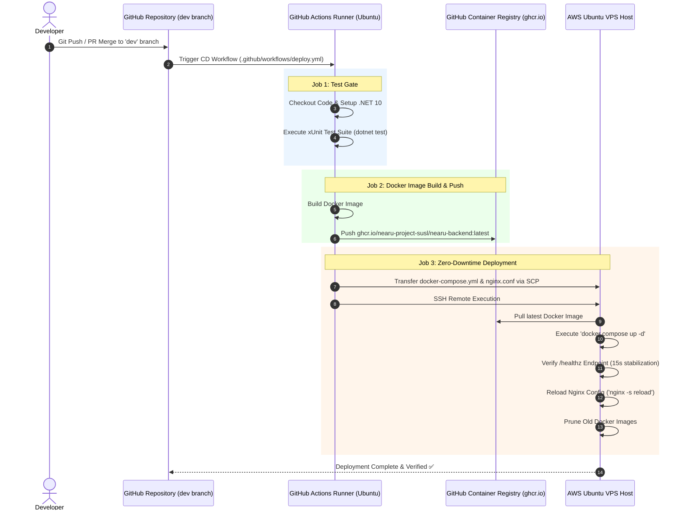

# NearU — Hosting Infrastructure & CI/CD Pipeline Specification

---

## 1. Hosting & Live Production Cloud Architecture

The NearU platform is deployed on a production-grade **AWS Ubuntu EC2 VPS** hosting the Docker container stack, paired with **Vercel Global CDN** for the web application, **Expo EAS** for mobile app distribution, and **GitHub Actions** for continuous delivery.

```
                                  ┌──────────────────────────────────────────┐
                                  │            Production Traffic            │
                                  └────────────────────┬─────────────────────┘
                                                       │
         ┌─────────────────────────────────────────────┼─────────────────────────────────────────────┐
         ▼                                             ▼                                             ▼
┌──────────────────────────────┐              ┌──────────────────────────────┐              ┌──────────────────────────────┐
│  Web Frontend: Vercel CDN    │              │  Backend API & Log Viewer    │              │ Mobile App: Expo EAS & Stores│
│ (React 19 / Vite SPA)        │              │  AWS EC2 VPS (Docker Mesh)   │              │ (iOS TestFlight & Android)   │
│ https://near-u-frontend...   │              │  https://api.nearusab.me     │              │ Scheme: nearu://             │
└──────────────────────────────┘              │  https://logs.nearusab.me    │              └──────────────────────────────┘
                                              └──────────────┬───────────────┘
                                                             │
                                              ┌──────────────┴──────────────┐
                                              ▼                             ▼
                               ┌─────────────────────────────┐ ┌─────────────────────────────┐
                               │ AWS EC2 Docker Services     │ │ Cloud Integrations          │
                               │  • nearu-api (Port 8080)    │ │  • AWS S3 + ImageKit CDN    │
                               │  • PostgreSQL 17 + PostGIS  │ │  • Firebase Cloud Messaging │
                               │  • Redis 7 Cache            │ │  • SendGrid Email API       │
                               │  • OSRM Sri Lanka Engine    │ └─────────────────────────────┘
                               │  • Dozzle Log Viewer (8888) │
                               │  • Nginx Alpine Proxy       │
                               └─────────────────────────────┘
```

---

## 2. Server & Infrastructure Specifications

### **1. Host / Server Configuration**
- **Cloud Provider & OS**: Amazon Web Services (AWS) — Single Ubuntu EC2 VPS Instance running Docker Engine.
- **Hostname Label**: `NearU-Dev-Droplet`
- **Network Interface Bindings**:
  - **IPv6**: Reachable on `[::]:80` and `[::]:443`.
  - **IPv4**: Bound to `0.0.0.0:80` and `0.0.0.0:443` in Docker port mappings.
- **Active Host System Services**:
  - `sshd`: Secured OpenSSH service.
  - `tailscaled`: Tailscale mesh network daemon for secure administrative host access.
  - `chrony`: NTP time synchronization service.
  - `unattended-upgrades`: Automatic OS security patching.

---

### **2. Nginx Reverse Proxy (`nearu-nginx`)**
- **Container Image**: `nginx:alpine`
- **Config Mount**: `/home/ubuntu/nginx.conf` mounted read-only (`:ro`) into `/etc/nginx/nginx.conf`.
- **Exposed Ports**:
  - `80` (HTTP) → Redirects all traffic to HTTPS.
  - `443` (HTTPS) → Serves `api.nearusab.me` and `logs.nearusab.me`.
- **Proxy Routing Logic**:
  - Serves `https://api.nearusab.me` → Proxies `/` to internal container `nearu-api:8080`.
  - Serves `https://logs.nearusab.me` → Proxies `/` to internal container `dozzle:8080`.
- **Timeouts & Payload Limits**:
  - Client Max Body Size: `15m` (Allows file/image uploads up to 15MB).
  - API Read / Send Timeouts: `60s`.
  - Dozzle Stream Timeout: `3600s`.

---

### **3. Domains & CORS Security Map**
- **API Domain**: `https://api.nearusab.me`
- **Log Viewer Domain**: `https://logs.nearusab.me`
- **Nginx CORS Map (Enforced at Proxy Layer)**:
  Handles preflight `OPTIONS` requests and enforces allowed origins:
  - `localhost` (Development testing)
  - `*.vercel.app` (Vercel preview & production deployments)
  - `https://nearusab.me` (Primary web domain)
  - `https://www.nearusab.me` (WWW web domain)
  - `https://api.nearusab.me` (API self-domain)

---

### **4. SSL / TLS Certificate Architecture**
- **Certificate Provider**: Let's Encrypt (Certbot).
- **Certificate Path**: `/etc/letsencrypt/live/api.nearusab.me/fullchain.pem` (Mounted into `nearu-nginx`).
- **Private Key Path**: `/etc/letsencrypt/live/api.nearusab.me/privkey.pem` (Shared across API and Logs subdomains).
- **Supported Protocols**: TLS 1.2, TLS 1.3 exclusively.
- **Cipher Suite**: `HIGH:!aNULL:!MD5`.

---

### **5. Application Stack Container (`nearu-api`)**
- **Container Image**: `ghcr.io/nearu-project-susl/nearu-backend:latest`
- **Framework & Environment**: ASP.NET Core 10 in `Production` mode.
- **Listen Port inside Mesh**: `8080` (`ASPNETCORE_HTTP_PORTS=8080`).
- **Environment Integration**:
  - PostgreSQL, Redis, OSRM, AWS S3, Firebase, SendGrid configured via `.env`.
  - `JWT_ISSUER`: `https://api.nearusab.me`.
  - Automated initial Admin seeding triggered on startup.

---

### **6. Production Data Stores**
- **PostgreSQL Database (`nearu-db`)**:
  - **Image**: `postgis/postgis:17-3.5-alpine`
  - **Port Binding**: Bound strictly to `127.0.0.1:54321:5432` (Exposed only to localhost; closed to public internet; accessible remotely via SSH tunnel).
  - **Persistent Volume**: `nearu_db_data`
- **Redis Distributed Cache (`nearu-redis`)**:
  - **Image**: `redis:7-alpine`
  - **Network Isolation**: Restricted strictly to internal Docker network (`nearu-internal`). No host port exposed.

---

### **7. Self-Hosted OSRM Routing Engine (`nearu-osrm`)**
- **Container Image**: `ghcr.io/project-osrm/osrm-backend` (Pinned by SHA digest).
- **Dataset File**: `/etc/nearu/osrm/sri-lanka-latest.osrm` (Extracted road network of Sri Lanka).
- **Profile**: Driving profile.
- **Execution Settings**: 5-second request timeout; throw on failure disabled.
- **Network Isolation**: Accessible only within `nearu-internal` network.

---

### **8. Observability & Log Streaming (`dozzle`)**
- **Container Image**: `amir20/dozzle`
- **Internal Port**: `8080` (Proxied via `https://logs.nearusab.me`) / Direct Host Port `8888`.
- **Function**: Streams real-time Docker container logs directly from `/var/run/docker.sock`.

---

### **9. Docker Networks**
1. `nearu-internal`: Isolated bridge network connecting `nearu-api`, `nearu-db`, `nearu-redis`, `nearu-osrm`, `dozzle`, and `nearu-nginx`.
2. `nearu-proxy`: External bridge network interface.

---

## 3. GitHub Actions Automated CI/CD Pipeline

Continuous Integration & Continuous Deployment (CI/CD) is fully automated using **GitHub Actions** workflows in `.github/workflows/`.



---

## 4. Security-Relevant Infrastructure Highlights

1. **Database Isolation**: The PostgreSQL container is NOT public facing; port `5432` is mapped to host `127.0.0.1:54321` and accessible only via SSH tunneling.
2. **TLS Certificate Reuse**: A single Let's Encrypt certificate for `api.nearusab.me` is shared across API and log viewer subdomains (`logs.nearusab.me`).
3. **CORS & Preflight Handling**: Preflight `OPTIONS` requests are handled directly at the Nginx reverse proxy layer.
4. **Max Upload Body Size**: Enforces a `15m` upload limit to accommodate profile photos, menu images, and accommodation photos without risking buffer overflow attacks.
5. **Zero-Downtime Reload**: Nginx executes `nginx -s reload` during deployments, preserving active WebSockets and HTTP requests.
